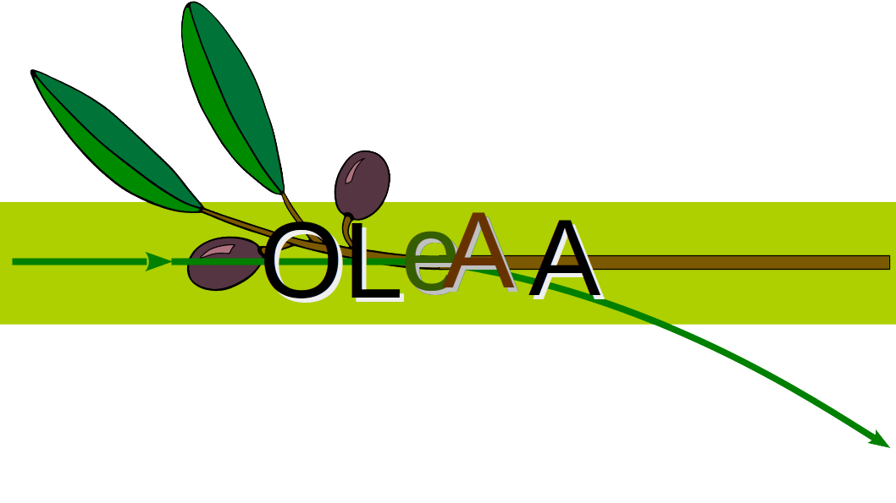
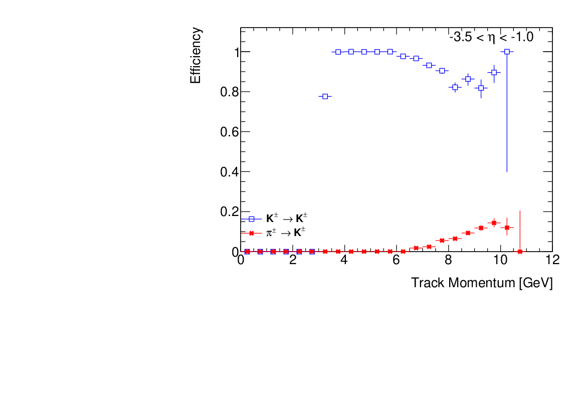
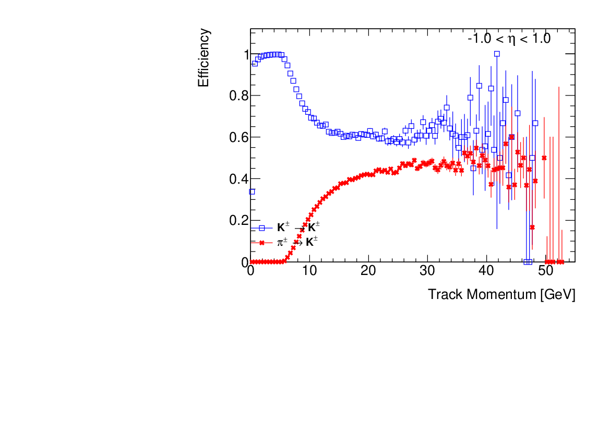
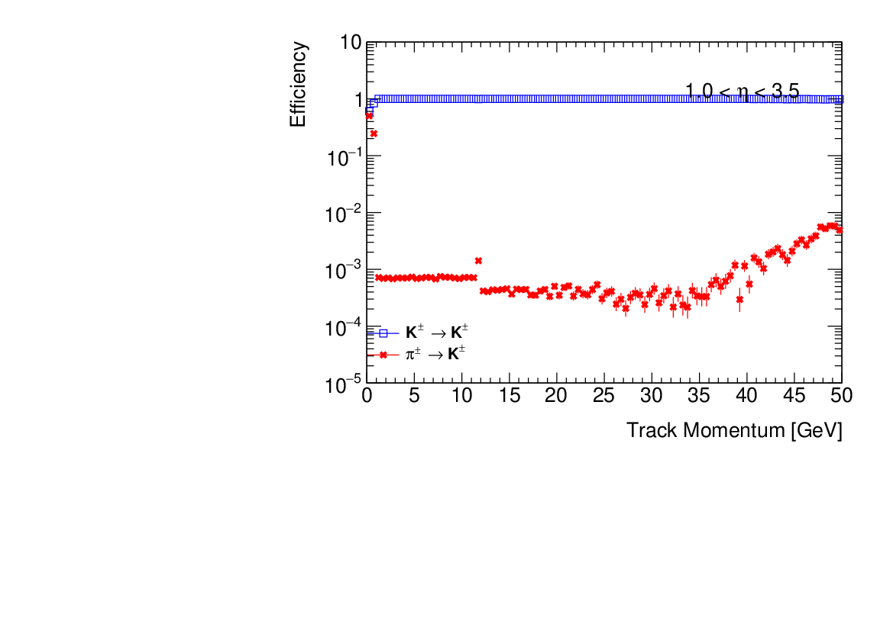

# Own Little e-A Analysis (OLeAA)

* Based on ideas from the BaBar and ATLAS Experiments, including the SimpleComposition framework (BaBar) and the CxAOD2 framework (ATLAS)
* Intended for fast analysis of Delphes-produced ROOT TTree structures
* Requirements: Delphes and GCC 8.X or higher to compile (utilizes C++-14)

Since one of the EIC proto-experiments is named after the Greek goddess Athena, favorite daughter of Zeus, I chose a name that reflects the association of the olive tree with her as a symbol. "Olea" is the genus of plants that includes the European olive tree, but includes a broader class of species.

## Author(s)

* Stephen Sekula (original)

## Building

Install Delphes. This project depends on classes defined in that project.

OLeAA contains a standalone Makefile. To build it:

```
cd OLeAA/
export DELPHES_PATH=<PATH WHERE DELPHES IS LOCATED>
make
```

If you don't set ```DELPHES_PATH```, make will complain until you do. :-)

## Running

OLeAA uses a TCL-based text configuration file (with the same basic structure as used in DELPHES) to setup the execution (creation of analysis modules, order of execution, etc).

For example, let's imagine you have produced a bunch of ROOT files using Delphes. Imagine the are located in a folder called ```Delphes_Output/```. To process those files using OLeAA:

```
./OLeAA.exe --input_dir="Delphes_Output/" --output_file="OLeAA_Results.root" --config_file="example.tcl" --nevents=100
```

This will load (by "globbing") all ROOT files found in ```Delphes_Output/```, write any eventual output to ```OLeAA_Results.root```, execute the modules defined in the TCL configuration file in the specified order (look inside example.tcl), and process just 100 events from the input ROOT files.

## Code Structure

### OLeAA.cc

This is the backbone of the code. It provides the main execution function. This globs all the ROOT files together from the input directory, instantiated any singleton-pattern classes needed for execution (more on those below), and then runs the event loop on the input ROOT files. In each element of the loop, it called all analysis modules in the order specified and uses their ```::execute()``` method to accomplish their intended tasks. It then fills the output event TTree once per loop execution, and repeats until it meets the target number of events or the end of the input ROOT files.

Singleton-pattern classes are used for global objects that should only ever have one instance in memory. These are:

* A TTree handler: this holds all branches for the output file and fills them when requested. You can add branches to this TTree from any module, but don't call the ```::Fill()``` method on your own; OLeAA.cc handles that.
* A Module handler: this keeps a record of all modules loaded, as well as their order; it can be used before the event loop to initialize modules, execute them during the event loop, and finalize them afterware.

### ModuleHandler.h (Singleton)

This keeps a record of all active modules and the order in which they are loaded. They are initialized, executed, and finalized in that order. There is only 1 instance of this class.

### TreeHandler.h (Singleton)

This holds the single output file and the tree inside of it. Eventually, this should be expanded to allow multiple trees, folders, etc. A richer structure is possible here.

### Module.h

The base class of all analysis modules. This defines basic functions like initialize, finalize, and execute, which are generally to be overridden by derived (child) classes.

### Module Child Classes

The existing examples are:

* KaonPIDModule: takes tracks and uses PID detector information to build a list of "reconstructed and identified" kaons. These currently are NOT energy flow tracks, but are raw tracks. You can use the Candidate->Particle data member (it stores a TRef) to match EFlowTrack objects to the Kaon objects to get the EFlowTrack refined kinematics.
* RefinerModule: takes a user-specific inputList (must be in the DataStore object defined in OLeAA.cc), runs selections on it (see below), and creates a new outputList with clones of the original candidates. This is a template class to allow refinement of different kinds of objects with different interfaces. The current typedefs associated with this template class are: JetRefinerModule (Jet), TrackRefinerModule (Track), NeutralRefinerModule (Photon), ElectronRefinerModule (Electron, and MuonRefinerModule (Muon).
* TreeWriterModule: event-level (MET, DIS variables) and candidate-level information can be customized in blocks and written to disk in a ROOT file. For example, you can create a list of jets in the fiducial region of the detector and then save Kinematic, Truth, and Flavor-Tagging information to the output ROOT file for each candidate just in that list.

### AnalysisFunctions.h

Defines inline global analysis functions (e.g. flavor tagging computations, DIS variables, etc.) that might be useful across modules. This would benefit from having a namespace that contains all its functions.

### RefinerModule Syntax

Here is an example:

```
module JetRefinerModule FiducialJet {
    set inputList Jet
    set outputList FiducialJet
    add selectors "PT 5.0:1000.0"
    add selectors "Eta -3.0:3.0"
}

```

The nominal Delphes "Jet" list defined in the ```delphes_EIC``` card is loaded. Each Jet candidate is then subjected to the logical AND of a pair of requirements: the pT of each is between 5.0-1000.0 GeV and the pseudorapidity (Eta) of each is between -3.0 and 3.0, well inside the fiducial region of a tracking system that goes to -4.0 - 4.0 in eta. 

Other variables currently supported:

* PT: transverse momemtum of jet or particle
* Eta: pseudorapidity of jet or particle
* Phi: azimuthal angle of jet or particle
* M: mass of jet or particle
* Q: charge of jet or particle

### TreeWriterModule

Here is an example:

```
module TreeWriterModule TreeWriter {
    add branches {Event} {} {MET DIS}
    add branches {Electron} {TaggingElectron} {Kinematics Truth}
    add branches {Jet} {FiducialJet} {Kinematics Truth JetTagging}
}
```

This stores three super-block of information:

* An "Event" block with no specified input list (that's how the code knows this is event-level). 
* An "Electron" block using candidates from the list "TaggingElectron"
* A "Jet" block using candidates from the list "FiducialJet"

For event-level information, the current variable-level blocks are:

* MET: ET and Phi
* DIS: truth-level Bjorken x, y, and Q-squared; reconstruction-level Jacquet-Blondel x and Q-squared

For candidate-level information:

* Kinematics: PT, Eta, Phi, Mass
* Truth: true particle or jet-level identity
* JetTagging: information from specific taggers, like the signed-IP3D tagger, as well as supporting information about tracks (momentum, their impact parameter significance, etc.)


## Future Development Ideas

* The DataStore map should be turned into a Singleton pattern class that is accessible by instance to all classes.
* A CutFlow tool should be added to streamline the process of adding, incrementing, and saving cut flows.

# Particle ID Studies (OUT-OF-DATE)

This section's code examples are out-of-date with the latest module generalization effort and need to be redone.

Particle ID efficiency maps have been introduced in the delphes_card_allsilicon_3T.tcl card. These model PID systems from eta=[-3.5,3.5], with an mRICH in the backward direction, a DIRC in the barrel, and a dualRICH in the forward direction. Below are example PID efficiency plots made using variables produced by OLeAA.





The variables produced by the OLeAA EventAnalysisModule that are relevant for studying track-level particle ID efficiency all begin with ```pid_track_*```. They are stored for every track in the angular coverage of the PID subsystems. The efficiency plots are made by projecting into two histograms the pT spectra of all tracks, or just tracks identified by a system, in the fiducial regions. To compute the ```X -> Y``` efficiency, the denominator (all tracks) histogram contains tracks that are truly of species ```X``` (```pid_track_true_pid```); the numerator histogram contains tracks reconstructed by the PID system as ```Y``` (```pid_track_reco_pid```).

The plots above were made using the script ```scripts/KaonIDEfficiency.C```. If the ROOT files resulting from running OLeAA are all in a directory called ```EICatIP6_PID_AllSilicon_3T```, then here is an example of running the script to compute the Kaon ID efficiency using the Dual RICH tracks. This includes the complete workflow for generating events, processing them with OLeAA, and making the plots:

```
mkdir delphes_card_allsilicon_3T/
DelphesPythia8 delphes_card_allsilicon_3T.tcl CC_DIS.template delphes_card_allsilicon_3T/out.root
cd OLeAA/
make -j2
mkdir allsilicon_3T
./OLeAA.exe --input_dir ../delphes_card_allsilicon_3T/out.root --output_file allsilicon_3T/out.root --module_sequence 'ElectronPIDModule,MuonPIDModule,TaggingModule,EventSelectionModule'
cd scripts/
root -q -l -b ./KaonIDStudy.C'+("../","allsilicon_3T/", "mRICHTrack", "*.root")'
root -q -l -b ./KaonIDStudy.C'+("../","allsilicon_3T/", "barrelDIRCTrack", "*.root")'
root -q -l -b ./KaonIDStudy.C'+("../","allsilicon_3T/", "dualRICHTrack", "*.root")'
```

## Notes on the dualRICH

The dualRICH has two components: aerogel (good for low-momentum) and C2F6 (good for high momentum). The transition in performance for these two subsystems occurs around 12 GeV/c of track momentum. As such, for tracks with momentum less than that threshold, the aerogel alone is used to make the PID decision. Above the threshold, C2F6 alone is used to make the decision. This results in a relatively flat performance in the efficiency plot for kaons, as expected.


